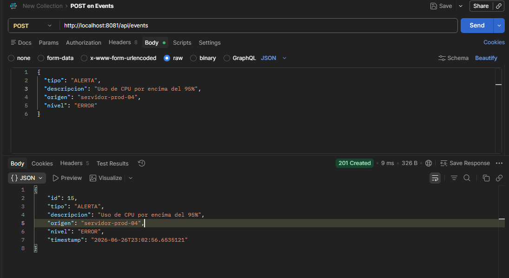
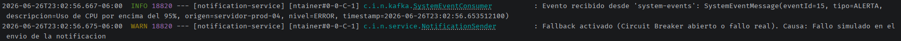
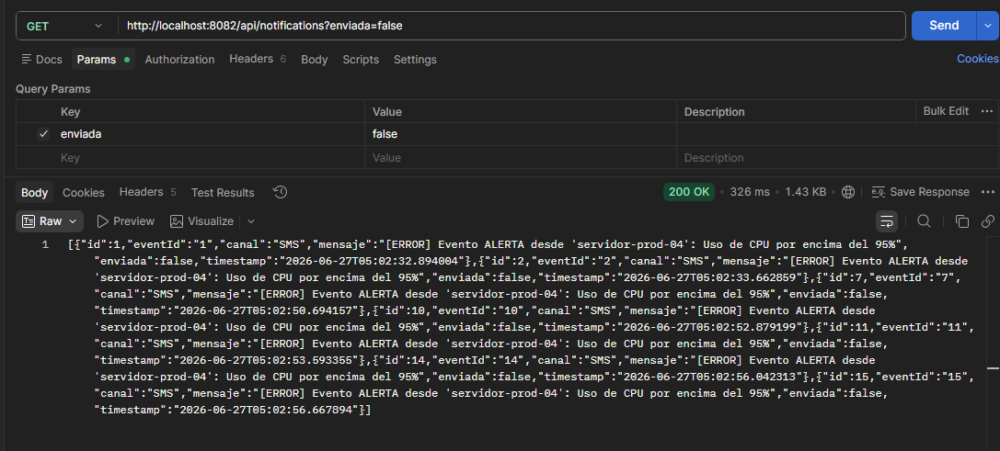
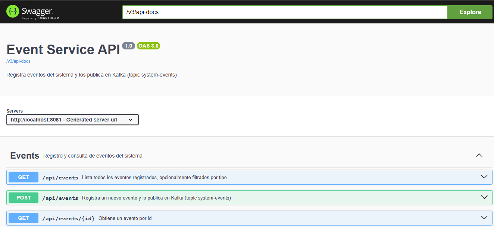
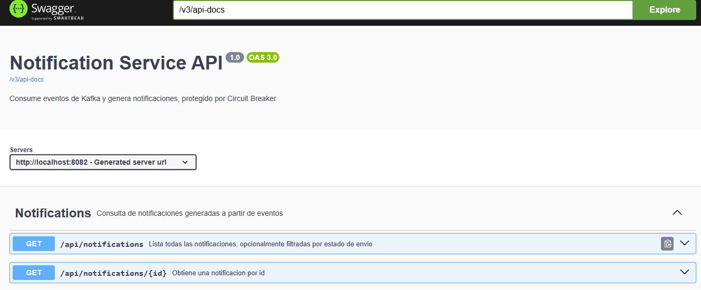
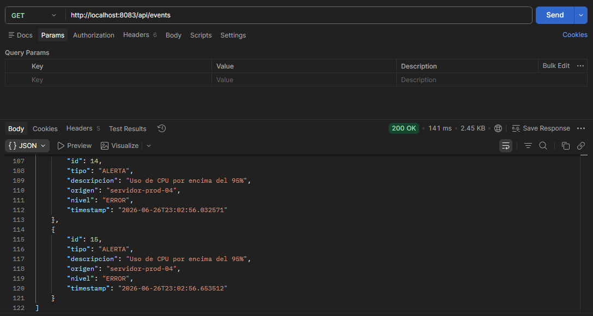

<a id="readme-top"></a>

[![Java][java-shield]][java-url]
[![Spring Boot][springboot-shield]][springboot-url]
[![Kafka][kafka-shield]][kafka-url]
[![Resilience4j][resilience4j-shield]][resilience4j-url]
[![Docker][docker-shield]][docker-url]
[![Maven][maven-shield]][maven-url]
[![Swagger][swagger-shield]][swagger-url]
[![H2][h2-shield]][h2-url]

<div align="center">
  <h3 align="center">Sistema de Notificaciones por Eventos</h3>
  <p align="center">
    Proyecto para validar los conocimientos obtenidos en el Track 07: Spring Boot 3 Microservices with Kubernetes and Angular, para ello se realizará el desarrollo de una arquitectura orientada a eventos con dos microservicios independientes comunicados vía Apache Kafka, protegidos con el patrón Circuit Breaker
    <br />

</div>

---

## Tabla de contenidos

<details>
  <summary>Ver contenidos</summary>
  <ol>
    <li><a href="#sobre-el-proyecto">Sobre el proyecto</a></li>
    <li><a href="#tecnologías">Tecnologías</a></li>
    <li><a href="#arquitectura">Arquitectura</a></li>
    <li><a href="#requisitos-previos">Requisitos previos</a></li>
    <li><a href="#instalación">Instalación</a></li>
    <li><a href="#uso">Uso</a></li>
    <li><a href="#endpoints">Endpoints</a></li>
    <li><a href="#circuit-breaker---cómo-probarlo">Circuit Breaker — cómo probarlo</a></li>
    <li><a href="#evidencia-de-ejecución">Evidencia de ejecución</a></li>
    <li><a href="#decisiones-de-diseño-relevantes">Decisiones de diseño relevantes</a></li>
    <li><a href="#plataforma-de-ia-elegida-y-justificación">Plataforma de IA elegida y justificación</a></li>
    <li><a href="#ramas-del-repositorio">Ramas del repositorio</a></li>
    <li><a href="#contacto">Contacto</a></li>
  </ol>
</details>

---

## Sobre el proyecto

Aplicación Spring Boot 3 con arquitectura multi-módulo que implementa el patrón **Event-Driven Architecture** mediante Apache Kafka y el patrón **Circuit Breaker** mediante Resilience4j. **Event Service** registra eventos del sistema y los publica en un topic de Kafka; **Notification Service** los consume y genera notificaciones, con su envío simulado protegido por Circuit Breaker. Ambos servicios se exponen a través de un **API Gateway** con Spring Cloud Gateway MVC.

**Características:**

- Arquitectura multi-módulo Maven (parent POM + 3 módulos)
- Comunicación asíncrona productor/consumidor vía Apache Kafka (JSON plano)
- Circuit Breaker con Resilience4j: umbral de fallo 50%, espera 2s, fallback automático
- API Gateway centralizando las rutas de ambos microservicios
- Documentación interactiva con Swagger UI (OpenAPI 3.x) en ambos servicios
- Orquestación completa con Docker Compose (Kafka + Zookeeper + 3 servicios)
- Respuestas HTTP correctas: 200, 201, 400, 404

<p align="right">(<a href="#readme-top">Regresar al inicio</a>)</p>

---

## Tecnologías

- Java 21 (LTS)
- Spring Boot 3.3.1
- Spring Data JPA + H2
- Spring for Apache Kafka
- Resilience4j (resilience4j-spring-boot3)
- Spring Cloud Gateway MVC
- Springdoc OpenAPI (Swagger UI)
- Docker + Docker Compose v2
- Maven (multi-módulo)

<p align="right">(<a href="#readme-top">Regresar al inicio</a>)</p>

---

## Arquitectura

```
Cliente
  │
  ▼
API Gateway (puerto 8083)
  │
  ├──► Event Service (puerto 8081) ──► [Kafka: topic "system-events"] ──┐
  │         (H2 en memoria)                                             │
  │                                                                     ▼
  └──► Notification Service (puerto 8082) ◄── consume el topic ────────┘
            (H2 en memoria, Circuit Breaker en el envío simulado)
```

Cada microservicio es dueño de su propia base de datos H2 — no comparten esquema. El Gateway es el único punto de entrada externo.

<p align="right">(<a href="#readme-top">Regresar al inicio</a>)</p>

---

## Requisitos previos

- Java 21 (JDK)
- IntelliJ IDEA (trae su propia distribución de Maven integrada)
- Docker 24+ y Docker Compose v2

Se comprueba la versión actual de Java mediante el siguiente comando:

<p align="right">(<a href="#readme-top">Regresar al inicio</a>)</p>

---

## Instalación

1. Clonar el repositorio

```sh
git clone https://github.com/joaquinzarates/track07-eventos-notificaciones-kafka.git
```

1. Entrar a la carpeta

```sh
cd track07-eventos-notificaciones-kafka
```

1. Abrir el proyecto en IntelliJ apuntando al `pom.xml` raíz (detecta los 3 módulos automáticamente)

<p align="right">(<a href="#readme-top">Regresar al inicio</a>)</p>

---

## Uso

### Servicios desde IntelliJ, Kafka en Docker

Levantar solo la infraestructura de mensajería:

```sh
docker compose up zookeeper kafka
```

Ejecutar desde IntelliJ, en este orden:

- `EventServiceApplication` (puerto 8081)
- `NotificationServiceApplication` (puerto 8082)
- `ApiGatewayApplication` (puerto 8083)

<p align="right">(<a href="#readme-top">Regresar al inicio</a>)</p>

---

## Endpoints

### Event Service

| Método | Endpoint | Descripción |
|---|---|---|
| POST | `/api/events` | Registra un evento y lo publica en Kafka |
| GET | `/api/events` | Lista todos los eventos |
| GET | `/api/events/{id}` | Obtiene un evento por id (404 si no existe) |
| GET | `/api/events?tipo={tipo}` | Filtra por tipo (CREACION, ACTUALIZACION, ELIMINACION, ALERTA) |

Ejemplo de body para POST:

```json
{
  "tipo": "ALERTA",
  "descripcion": "Uso de CPU por encima del 90%",
  "origen": "servidor-prod-01",
  "nivel": "ERROR"
}
```

### Notification Service

| Método | Endpoint | Descripción |
|---|---|---|
| GET | `/api/notifications` | Lista todas las notificaciones |
| GET | `/api/notifications/{id}` | Obtiene una notificación por id (404 si no existe) |
| GET | `/api/notifications?enviada={true\|false}` | Filtra por estado de envío |

### Documentación interactiva (Swagger UI)

- Event Service: `http://localhost:8081/swagger-ui/index.html`
- Notification Service: `http://localhost:8082/swagger-ui/index.html`

<p align="right">(<a href="#readme-top">Regresar al inicio</a>)</p>

---

## Circuit Breaker — cómo probarlo

El método de envío simulado (`NotificationSender.enviarNotificacionSimulada`) falla aleatoriamente ~40% de las veces, a propósito, para poder observar el Circuit Breaker en acción sin esperar mucho tiempo.

**Paso 1 — Generar tráfico**

Envía varios eventos seguidos vía `POST /api/events` (5 o más).

**Paso 2 — Revisar logs**

En la consola de `notification-service` verás líneas `Notificacion enviada (simulada)` y otras `Fallback activado...` — con dos causas distintas posibles:

- `Causa: Fallo simulado en el envio de la notificacion` → el método se ejecutó y falló (cuenta hacia el umbral)
- `Causa: CircuitBreaker 'envioNotificacion' is OPEN and does not permit further calls` → el circuito ya está abierto y bloqueó la llamada antes de intentarla

**Paso 3 — Confirmar el ciclo completo**

En una corrida real de pruebas se observó el ciclo: `CLOSED` (fallos acumulando) → `OPEN` (bloqueo directo tras superar 50% de fallos) → espera de 2 segundos → `HALF_OPEN` (prueba) → `CLOSED` de nuevo tras una llamada exitosa.

**Paso 4 — Verificar notificaciones no enviadas**

```
GET http://localhost:8083/api/notifications?enviada=false
```

Respuesta esperada: lista de notificaciones marcadas como no enviadas por el fallback.

<p align="right">(<a href="#readme-top">Regresar al inicio</a>)</p>

---

## Evidencia de ejecución

Capturas de pantalla del sistema funcionando de extremo a extremo



El endpoint `POST /api/events` recibe el evento y responde `201 Created` con el objeto creado, incluyendo el `id` y `timestamp` autogenerados por el servidor.



Ciclo completo del Circuit Breaker observado en una corrida real de pruebas: fallos simulados acumulándose, el circuito abriéndose (`CircuitBreaker 'envioNotificacion' is OPEN`), y la recuperación posterior tras el periodo de espera configurado.



`GET /api/notifications?enviada=false` mostrando las notificaciones que el fallback marcó como no enviadas durante la apertura del circuito.



Documentación interactiva de Event Service, generada automáticamente por Springdoc OpenAPI.



Documentación interactiva de Notification Service, generada automáticamente por Springdoc OpenAPI.



Misma petición que en la primera captura, esta vez dirigida al puerto 8083 (API Gateway), confirmando que el enrutamiento hacia Event Service funciona correctamente.

<p align="right">(<a href="#readme-top">Regresar al inicio</a>)</p>

---

## Decisiones de diseño relevantes

- **JSON plano en Kafka, no Avro:** el repositorio del curso de referencia (Programming Techie) usa Avro + Confluent Schema Registry. Se decidió simplificar a JSON plano.
- **Circuit Breaker en una clase separada (`NotificationSender`):** Resilience4j funciona mediante un proxy de Spring AOP que solo intercepta llamadas entrantes desde fuera del bean. Si el método protegido estuviera en la misma clase que lo invoca, el Circuit Breaker se ignoraría en silencio (el "self-invocation problem").
- **`wait-duration-in-open-state: 2s`:** la rúbrica menciona dos cifras ("tiempo de espera de 2 segundos" y "HALF_OPEN tras 5 segundos") para lo que normalmente es un solo parámetro en Resilience4j. Se interpretó 2s como `wait-duration-in-open-state`, y 5 como `permitted-number-of-calls-in-half-open-state`.
- **Perfiles `docker` separados:** cada servicio tiene un `application-docker.yml` que sobrescribe únicamente las propiedades de red, activado vía `SPRING_PROFILES_ACTIVE=docker` solo dentro de los contenedores.
- **`spring.json.value.default.type` explícito en el consumer:** al desactivar `spring.json.use.type.headers` (necesario porque productor y consumidor no comparten clase Java), `JsonDeserializer` perdía toda forma de saber a qué clase mapear el mensaje. Se declaró el tipo de destino explícitamente para resolverlo.

<p align="right">(<a href="#readme-top">Regresar al inicio</a>)</p>

---

## Plataforma de IA elegida y justificación

**Plataforma utilizada:** Claude (Anthropic), capa gratuita.

**Motivo de la elección:** .

**Ejemplos concretos de uso durante el desarrollo, con el prompt real utilizado:**

1. **Detección del "self-invocation problem" de Spring AOP.**
   > *Prompt:* "todas las preguntas que me hagas podrían ser buenos prompts para las evidencias, por otro lado, dime el sender como clase separada afectará la a la ejecución?"

   El diseño inicial (envío simulado como método dentro de `NotificationService`, llamado desde otro método de la misma clase) habría hecho que `@CircuitBreaker` se ignorara en tiempo de ejecución sin ningún error visible. Se solicitó una explicación completa del mecanismo de proxies de Spring AOP antes de aceptar el cambio a una clase separada (`NotificationSender`),

2. **Diagnóstico de un fallo de Kafka mediante logs en cascada.**
   > *Prompt:* "cuando ejecuto NotificationServiceApplication [se pegó el log de conexión rechazada]"

   Un error 500 inicial resultó no ser un bug de aplicación: `docker ps` reveló que el contenedor de Kafka nunca llegó a iniciar, y `docker compose logs kafka` mostró la causa real (`No security protocol defined for listener PLAINTEXT_HOST`, por faltar la variable `KAFKA_LISTENERS`).

3. **Corrección de un deserializer de Kafka mal configurado.**
   > *Prompt:* "(?, ?, ?, ?, ?, default) [se pegó el stack trace completo de IllegalStateException: No type information in headers and no default type provided]"

   Se identificó que desactivar `spring.json.use.type.headers` eliminaba la única forma en que `JsonDeserializer` podía inferir el tipo de destino, y que faltaba declarar `spring.json.value.default.type` explícitamente para compensarlo.

4. **Auditoría de integridad del código antes de hacer commit.**
   > *Prompt:* "Antes de hacer commit, ¿revisamos uno por uno los 8 archivos modificados con 'git diff' para confirmar que cada cambio es intencional?"

   Esta revisión sistemática, archivo por archivo, detectó múltiples problemas reales antes de subirlos al repositorio: una dependencia (`spring-boot-starter-data-jpa`) eliminada por accidente, el `pom.xml` de `notification-service` sobrescrito completo con el contenido del `pom.xml` raíz, y dos archivos (`NotificationRepository.java`, `Notification.java`) que nunca habían llegado a confirmarse en git pese a existir en disco.

**Reto enfrentado:** durante la verificación pre-commit se descubrió que varios archivos del proyecto habían quedado vacíos o sobrescritos con contenido incorrecto en algún punto del desarrollo, sin que esto fuera evidente hasta revisar `git diff` archivo por archivo. Esto reforzó la importancia de auditar cada cambio antes de subirlo.

<p align="right">(<a href="#readme-top">Regresar al inicio</a>)</p>

---

## Contacto

Joaquin Zárate - <joaquin.zarate@ids.com.mx>

Link del proyecto: [Sistema de Notificaciones por Eventos](https://github.com/joaquinzarates/track07-eventos-notificaciones-kafka)

<p align="right">(<a href="#readme-top">Regresar al inicio</a>)</p>

---

[java-shield]: https://img.shields.io/badge/Java-21_LTS-7bc67e?style=for-the-badge&logo=openjdk&logoColor=white
[java-url]: https://www.oracle.com/java/
[springboot-shield]: https://img.shields.io/badge/Spring_Boot-3.3.1-778ca3?style=for-the-badge&logo=springboot&logoColor=white
[springboot-url]: https://spring.io/projects/spring-boot
[kafka-shield]: https://img.shields.io/badge/Apache_Kafka-Event_Driven-a78bca?style=for-the-badge&logo=apachekafka&logoColor=white
[kafka-url]: https://kafka.apache.org
[resilience4j-shield]: https://img.shields.io/badge/Resilience4j-Circuit_Breaker-5ba4cf?style=for-the-badge
[resilience4j-url]: https://resilience4j.readme.io
[docker-shield]: https://img.shields.io/badge/Docker_Compose-Orchestration-e07b6a?style=for-the-badge&logo=docker&logoColor=white
[docker-url]: https://docs.docker.com/compose/
[maven-shield]: https://img.shields.io/badge/Maven-Multi--module-e8a87c?style=for-the-badge&logo=apachemaven&logoColor=white
[maven-url]: https://maven.apache.org
[swagger-shield]: https://img.shields.io/badge/Swagger-OpenAPI_3.0.1-6db8a8?style=for-the-badge&logo=swagger&logoColor=white
[swagger-url]: https://swagger.io
[h2-shield]: https://img.shields.io/badge/H2-In--Memory_DB-e88c8c?style=for-the-badge
[h2-url]: https://www.h2database.com
